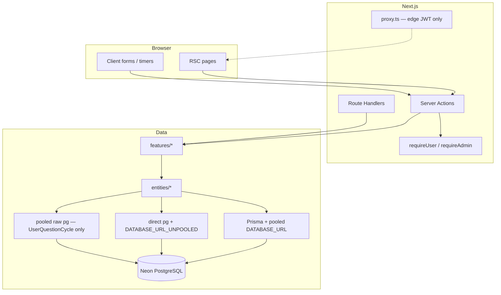
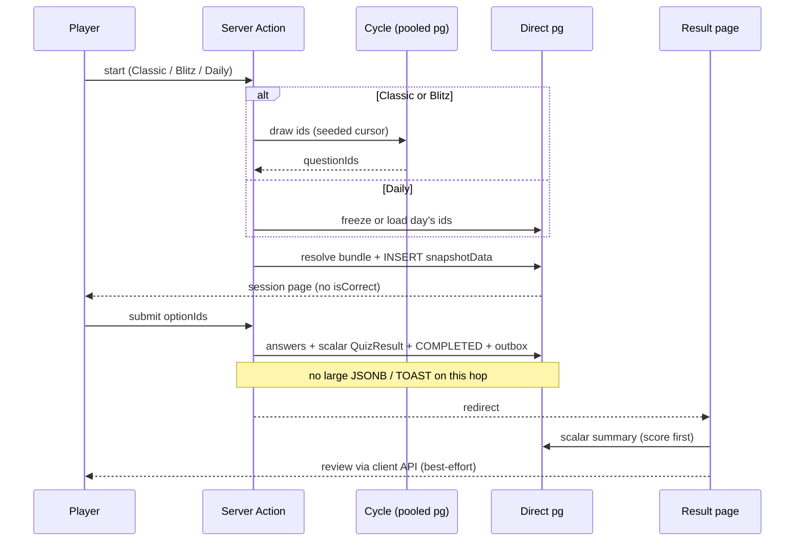

# GameMind architecture

Stable overview of how the app is structured and which invariants must not regress.  
Dated “why we chose this” lives in [`DECISIONS.md`](./DECISIONS.md). Binding quiz/Neon rules: [`QUIZ_NEON_HOT_PATH.md`](./QUIZ_NEON_HOT_PATH.md).

## Product shape

Three play modes share one session model (`QuizSession` + frozen `snapshotData` + server scoring):

| Mode | Discriminator | Player contract |
|------|----------------|-----------------|
| Classic | `dailyChallengeId` and `timedEndsAt` both NULL | Difficulty + 1–10 questions; rematch; anti-repeat cycle |
| Blitz (Timed) | `timedEndsAt` set | 10 questions, 60s **server** deadline, 3s grace; partial answers OK |
| Daily | `dailyChallengeId` set | Moscow calendar day; `MEDIUM` × 10; one attempt; no cycle |

Quiz pool = `Question.isActive = true` **and** `publicationStatus = PUBLISHED`.  
`isActive` is archive/soft-hide; `publicationStatus` is draft → review → publish. They are orthogonal.

## Layers

Feature-based layout. UI does not import Prisma; Server Actions do not trust the client for score, role, or `userId`.

```txt
src/app/          presentation + Route Handlers (App Router, [locale])
src/features/     use-cases: actions, Zod, mappers, Client islands
src/entities/     persistence: Prisma and/or parameterized pg
src/lib/          prisma, auth guards, direct-pg, rate-limit, storage
src/shared/       UI primitives, i18n dictionaries, small utils
src/proxy.ts      Edge: locale redirect + JWT UX. Not the security boundary.
```



**Default data access:** Prisma on pooled `DATABASE_URL` for ordinary CRUD (auth, simple reads).

**Direct `pg`:** confirmed fragile Neon paths — quiz start pick/snapshot, submit complete, result summary, admin list/writes, leaderboard `DISTINCT ON`. One process-wide Direct queue in `next dev`; a hung hop stalls Home / Daily / start.

**UserQuestionCycle** (Classic / Blitz pick): scalars only (`cycleSeed` / `cursor` / `poolSize`) via `withPooledPgClient` **outside** the Direct queue. Daily does not use the cycle. Boundary is **reshuffle-first** (not drain-then-top-up). No silent `ORDER BY RANDOM` fallback.

## Quiz integrity



Invariants:

1. Snapshot at **start** freezes question ids, option order, `isCorrect`, bilingual texts, image URLs. Mid-session bank edits must not change that session.
2. Public quiz UI never exposes `isCorrect`. Scoring uses snapshot `optionId`s only.
3. **Complete hop** writes answers + **scalar** `QuizResult` + `COMPLETED` + achievement outbox. No fat `snapshotData` / `reviewSnapshot` JSON into pg on that hop.
4. `reviewPayload` is after successful complete, non-blocking. Review failure must not fail submit.
5. Result: paint score first. Soft-miss on transient read — never `notFound()` (sticky App Router 404).
6. Client timer / client score / client `userId` are not authority. Blitz deadline is `timedEndsAt` on the row.
7. Adding questions is a **content** change (draft → publish). Do not “optimize” by stuffing more JSON into submit/result.

Classic and Blitz keep **separate start runners**. Shared pick resolve chunk size stays 5. Daily lobby uses **one** Direct TLS. After a wedged Direct queue: restart `npm run dev`; do not raise global timeouts or re-enable keep-warm.

## Auth and security

- Auth.js credentials + bcryptjs hashes. JWT carries `id`, `username`, `role` for fast reads.
- `requireUser()` / `requireAdmin()` reload the `User` row: deleted / `isActive = false` → login; admin uses **DB** `role`, not the token.
- `proxy.ts` stays edge-safe (no Prisma, bcrypt, or server-only modules). Hiding a nav link is UX; pages and Server Actions are the real gate.
- Zod validates Server Action input. Never trust client-provided score, role, or `userId`.
- In-memory fixed-window rate limits on login/register, password, avatar, admin upload, quiz start+submit. Per-instance on Vercel (not a global Redis quota).
- Result pages are owner-only for normal users. Admin may see aggregates on a user detail page; opening another player’s full answer review is still deferred.

## i18n and UI

- Default locale `ru`; routes `/ru`, `/en`. No `next-intl` until plural/date tooling is actually needed.
- Question/option display follows the **current URL locale** from bilingual snapshot `texts` (v2). Scoring is language-agnostic.
- Theme: `data-theme="light" | "dark"` + CSS variables; Tailwind v4 `@theme inline`.
- Visual identity: Scoreboard Editorial (`docs/TASTE_SKILL.md`). New UI extends the lock; it does not invent a second language.

## Media

| Role | Where |
|------|--------|
| Seed IMAGE_GUESS | Git `public/quiz-images/**/*.webp` (same origin) |
| Uploads (quiz + avatars) | Adapter: local `public/media/` or **Vercel Blob** |
| Public URL | Relative `/media/...`; Next rewrite → Blob on production |
| DB | URL (+ optional `storageKey`) only — never bytes in Postgres |
| Process | `sharp` at **upload** time (WebP). Snapshot freezes `imageUrl` at start |

Cloudflare R2 is **not** the default (RU audience + dashboard/ops). Yandex Object Storage is a documented fallback, not implemented yet.

## Content lifecycle

```txt
author JSON  →  validate (Zod, no DB)  →  import DRAFT  →  admin quality gate  →  PUBLISHED
```

Import never writes `PUBLISHED`. Quality gate is a pure function (`getQuestionPublishQualityIssues`); Server Actions enforce it. TEXT import is **not** idempotent (new UUIDs) — do not re-import a published batch.

After a schema-changing quiz deploy, run `prisma migrate deploy` on **production** Neon. Missing columns (`AchievementOutbox`, review, cycle, …) break submit/result even if Vercel shipped the new JS.

## What this file is not

- Not a session diary — that is gitignored `docs/PROJECT_CONTEXT.md`.
- Not a substitute for [`QUIZ_NEON_HOT_PATH.md`](./QUIZ_NEON_HOT_PATH.md) when changing start/submit/result/Direct.
- Not a license to merge Classic and Blitz runners, put cycle on the Direct queue, or bump timeouts “to fix hangs”.
